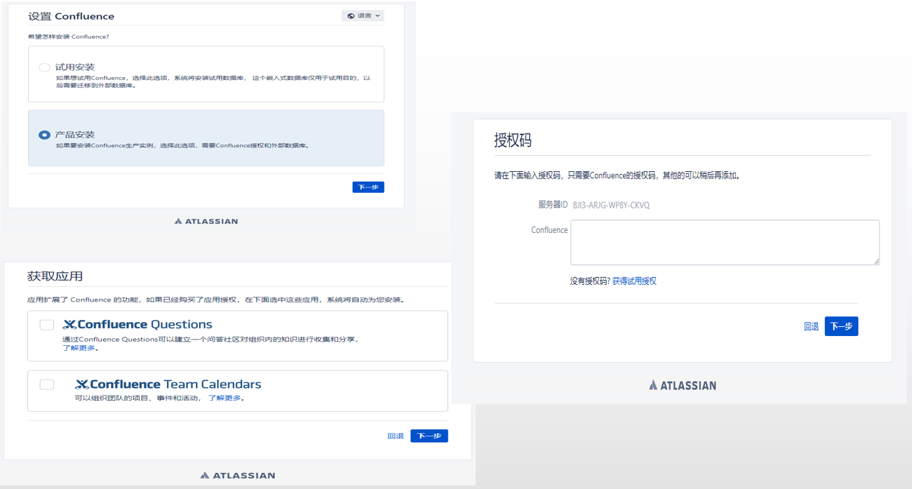
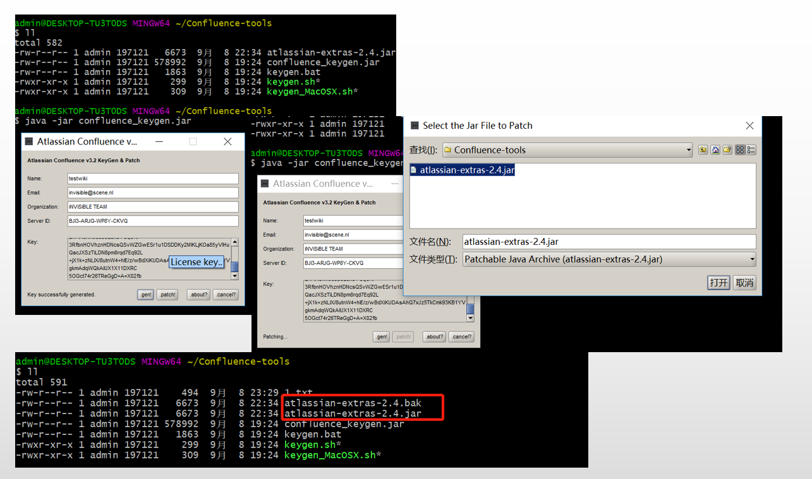
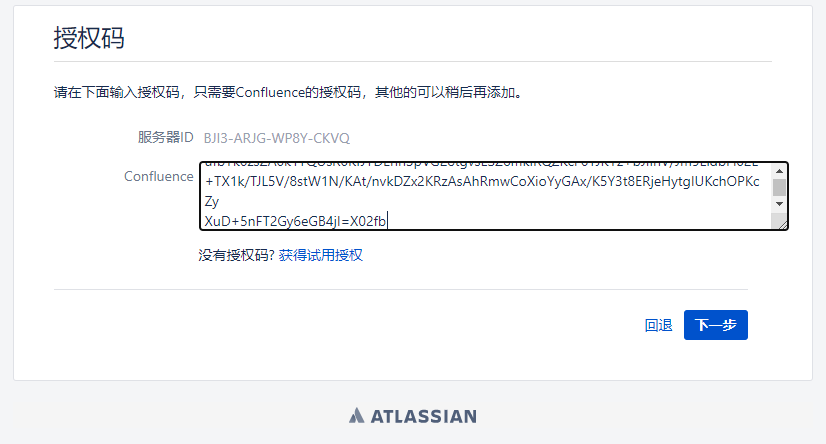

#### 安装 JDK

```
~]# yum install -y java-1.8.0-openjdk java-1.8.0-openjdk-devel
~]# java -version
openjdk version "1.8.0_262"
OpenJDK Runtime Environment (build 1.8.0_262-b10)
OpenJDK 64-Bit Server VM (build 25.262-b10, mixed mode)

```

#### 安装数据库

1.  Adding the MySQL Yum Repository

```
~]# wget https://dev.mysql.com/get/mysql80-community-release-el7-2.noarch.rpm
~]# rpm -ivh mysql80-community-release-el7-2.noarch.rpm
```

2.  Selecting a Release Series

```
~]# yum repolist all | grep mysql
~]# yum install yum-utils
~]# yum-config-manager --disable mysql80-community
~]# yum-config-manager --enable mysql57-community
```

3. Installing MySQL

```
~]# yum install -y mysql-community-server
```

4. Configure MySQL

```
[mysqld]
skip_name_resolve=on
innodb_file_per_table=on
collation_server=utf8_unicode_ci
character_set_server=utf8
skip-character-set-client-handshake
innodb_log_file_size=2GB
max_allowed_packet=256m
sql_mode=ONLY_FULL_GROUP_BY,NO_ZERO_IN_DATE,NO_ZERO_DATE,ERROR_FOR_DIVISION_BY_ZERO,NO_AUTO_CREATE_USER,NO_ENGINE_SUBSTITUTION
transaction-isolation=READ-COMMITTED
```

5. Starting the MySQL Server

```
~]# systemctl  start mysqld
~]# systemctl  enable mysqld
```

6. Modify Root Password

```
~]# grep 'temporary password' /var/log/mysqld.log
2020-09-08T13:47:35.062445Z 1 [Note] A temporary password is generated for root@localhost: VoDF0g+T_f2t
~]# mysql -uroot -p'VoDF0g+T_f2t'
mysql>  ALTER USER 'root'@'localhost' IDENTIFIED BY 'MyNewPass4!';
~]# mysql -uroot -p'MyNewPass4!'
```

7. Database authorization

```
mysql> create database confluence default character set utf8 collate utf8_bin;
mysql> grant all on confluence.* to 'confluence'@'%' identified by 'confluence@PASS123';
mysql> flush privileges;
~]# mysql -uconfluence -p'confluence@PASS123'
```

#### 安装  Confluence

1. 安装

```
~]#  wget https://product-downloads.atlassian.com/software/confluence/downloads/atlassian-confluence-7.2.0-x64.bin
~]# chmod  +x atlassian-confluence-7.2.0-x64.bin
~]# ./atlassian-confluence-7.2.0-x64.bin
~]# ./atlassian-confluence-7.2.0-x64.bin
Unpacking JRE ...
Starting Installer ...

This will install Confluence 7.2.0 on your computer.
OK [o, Enter], Cancel [c]
o
Click Next to continue, or Cancel to exit Setup.

Choose the appropriate installation or upgrade option.
Please choose one of the following:
Express Install (uses default settings) [1],
Custom Install (recommended for advanced users) [2, Enter],
Upgrade an existing Confluence installation [3]
1

See where Confluence will be installed and the settings that will be used.
Installation Directory: /opt/atlassian/confluence
Home Directory: /var/atlassian/application-data/confluence
HTTP Port: 8090
RMI Port: 8000
Install as service: Yes
Install [i, Enter], Exit [e]
i

Extracting files ...


Please wait a few moments while we configure Confluence.

Installation of Confluence 7.2.0 is complete
Start Confluence now?
Yes [y, Enter], No [n]
y

Please wait a few moments while Confluence starts up.
Launching Confluence ...

Installation of Confluence 7.2.0 is complete
Your installation of Confluence 7.2.0 is now ready and can be accessed via
your browser.
Confluence 7.2.0 can be accessed at http://localhost:8090
Finishing installation ...
```

2. 访问 web



获取到服务器ID：`BJI3-ARJG-WP8Y-CKVQ`

#### 破解 Conflucence

1. 停止服务

```
~]# cd /opt/atlassian/confluence/bin/ && ./shutdown.sh
```

2. 将atlassian-extras-decoder-v2-3.4.1.jar从 wiki 服务器拷贝到本地机器上并进行重命名为atlassian-extras-2.4.jar

```
$ scp 172.18.0.14:/opt/atlassian/confluence/confluence/WEB-INF/lib/atlassian-extras-decoder-v2-3.4.1.jar ./atlassian-extras-2.4.jar
```


3. 将该 `.jar` 文件跟破解工具放在一起，然后运行破解工具

```
$ java -jar confluenc_keygen.jar
```
先点击 `.gen`, 在点击 `patch`, 选择要破解的文件(即从服务器copy下来的 jar 文件)破解



完成后，破解复制Key到Confluence里，然后点击下一步




#### 配置数据库


1. 安装数据库驱动

```
~]# wget https://cdn.mysql.com//Downloads/Connector-J/mysql-connector-java-5.1.48.tar.gz
~]# tar -xf mysql-connector-java-5.1.48.tar.gz
~]# cp mysql-connector-java-5.1.48/*.jar /opt/atlassian/confluence/confluence/WEB-INF/lib
```

2. 重启服务

```
~]# /opt/atlassian/confluence/bin/shutdown.sh
~]# /opt/atlassian/confluence/bin/startup.sh
```


测试连接成功后，点击下一步，耐心等待安装完成
